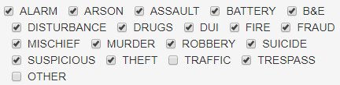

<style type="text/css">

body, td {
   font-size: 18px;
}
h1 {
  font-size: 32px;
  font-weight: bold;
}
h2 {
  font-size: 28px;
  font-weight: bold;
}
h3 {
  font-size: 24px;
  font-weight: bold;
}
h4 {
  font-size: 20px;
  font-weight: bold;
}
code.r{
  font-size: 16px;
}
pre {
  font-size: 16px
}
</style>

## 1.0 Introduction

This notebook shows the procedure followed to munge the dataset of [Orlando police calls from 2009 to 2015](https://data.cityoforlando.net/Orlando-Police/OPD-Calls-for-Service-Data-Lens/uum9-29mz), which I used to put together a [police calls map](https://carlosgg.shinyapps.io/orlando-police-calls-map/).

### 1.1 Reading the data

I stored the dataset in [Google Drive](https://drive.google.com/uc?export=download&confirm=GB0t&id=1_T-x10WKPCAtbpsTT-ltNEiiKpQtLRbU), just click to download the file. You may get a warning that the file is too big for Google to scan for viruses, so it asks you if you want to download it anyway. 


<br>

Just click where it says "Download anyway". It's [tricky](https://stackoverflow.com/questions/14728038/disabling-the-large-file-notification-from-google-drive) to get around that warning in R and just read the file from Google Drive to the computer, because it seems Google periodically changes things around. Hence, I think the safest reproducible way is to manually download the file to your computer as described above.

The dataset clocks in at 474 MB, so it takes some time to download. Also, even if the file was stored locally, using the standard `read.csv()` takes a long time to read in such a mammoth file. Instead, we can use `read_csv()` from the [`readr package`](https://cran.r-project.org/web/packages/readr/readr.pdf). On my computer, `read_csv()` is about 3 times faster than `read.csv()`. I assume you clicked on the Google Drive link above and downloaded the file locally. Throughout the notebook, I will keep track of how long it takes to do the various operations on my computer.

```{r, message=FALSE, warning=FALSE}
library(readr)
start <- Sys.time()
police_calls <- read_csv("Calls_For_Service_2009_-_2015.csv")
read_time <- Sys.time() - start
cat("It took", as.numeric(read_time, units = "secs"), "seconds to read the file.")
```
<br>

Take a look at the data:
```{r}
str(police_calls, give.attr = FALSE)
```
<br>

So we have some 3 million observations and 8 columns.

## 2.0 Munging

Loading some libraries we will be using
```{r, message=FALSE, warning=FALSE}
library(chron) # for dealing with chronological objects, i.e., dates and times
library(magrittr) # pipe operator %>%
```
<br>

### 2.1 Renaming columns

Rename columns to remove spaces:
```{r}
start <- Sys.time()
names(police_calls)[names(police_calls) == 'Incident Number'] <- 'Incident_Number'
names(police_calls)[names(police_calls) == 'Incident Date Time'] <- 'Incident_Date_Time'
names(police_calls)[names(police_calls) == 'Incident Location'] <- 'Incident_Location'
names(police_calls)[names(police_calls) == 'Incident Type'] <- 'Incident_Type'
names(police_calls)[names(police_calls) == 'Incident Disposition Class'] <- 'Incident_Disposition_Class'
names(police_calls)[names(police_calls) == 'Incident Disposition'] <- 'Incident_Disposition'
rename_time <- Sys.time() - start
cat("It took", rename_time, "seconds to rename the columns.")
```

### 2.2 Dates and times

In the [application](https://carlosgg.shinyapps.io/orlando-police-calls-map/) I plan to use the data for, we need the day of the week the incidents took place, i.e., Monday, Tuesday, ... The `dates` function from the **chron** package converts "mm/dd/yyyy" into a "dates" object, which in turn is converted to a "Date" object by `as.Date()`. Then `weekdays()`

```{r}
start <- Sys.time()
#Get the dates of incidents
police_calls_dates <- substr(police_calls$Incident_Date_Time, 1, 10) %>% dates() %>% as.Date("%m/%d/%y")
## str(police_calls_dates)
##  Date[1:3051265], format: "2009-01-01" "2009-01-01" "2009-01-01" "2009-01-01" "2009-01-01" ...

#Create new column consisting of days of week incidents took place
# weekdays(yyyy-mm-dd) returns the day of the week of that date
police_calls$days <- weekdays(police_calls_dates) # vector of "Wednesday" , "Saturday", ...
weekdays_time <- Sys.time() - start
cat("It took", weekdays_time, "seconds to compute the weekdays from the dates.")
```
<br>

Now we want to extract the hour in which the events took place. We will be using 24-hour format, so 4 P.M. will be 16. 
```{r}
start <- Sys.time()
#Get the times, in 24-hour format, the incidents took place
#Using strptime() per this S.O. post:
#http://stackoverflow.com/questions/29833538/convert-12-hour-character-time-to-24-hour
police_calls_times <- substr(police_calls$Incident_Date_Time, 12,22) %>% strptime("%I:%M:%S %p") %>% format(format = "%H:%M:%S") %>% times()
## str(police_calls_times, give.attr = FALSE)
## Class 'times'  atomic [1:3051265] 0.000694 0.000694 0.001389 0.001389 0.002083 ...
#Create new column consisting of hour of day incidents took place
police_calls_hours <- hours(police_calls_times)
hours_time <- Sys.time() - start
cat("It took", as.numeric(hours_time, units = "mins"), "minutes to compute the hours from the times.")
```

Now we want to use `police_calls_hours` to compute the time period in which the events took place: "early_morning", "morning", "afternoon", and "evening".

```{r}
start <- Sys.time()
#Create a new column consisting of time period incidents took place
# Determine periods as follows:
# Early Morning (before 6 AM): 0, Morning (between 6 AM and 12 PM): 1
# Afternoon (between noon and 6 PM): 2, Evening (between 6 PM and midnight): 3
# Defining a function that does just that
hours_to_periods <- function(hour) {if (hour %/% 6 == 0) "early_morning" else if (hour %/% 6 == 1) "morning" else if (hour %/% 6 == 2) "afternoon" else "evening"}
# Applying the function to the police_calls_hours vector
police_calls$periods <- sapply(police_calls_hours, hours_to_periods)
periods_time <- Sys.time() - start
cat("It took", as.numeric(periods_time, units = "secs"), "seconds to compute the hours from the times.")
```

### 2.3 Circumscribing incidents into categories

I ultimately want to design a UI that allows users to click on the incident categories they want displayed, using checkboxes. The data as given has too many incident types to allow that.

```{r}
num_types <- length(unique(police_calls$Incident_Type))
cat("There are", num_types, "incident types in the dataset.")
```
<br>

It is not practical to include 142 checkboxes in a UI, so I want to aggregate them into a few categories so that the UI won't be overwhelming. Here is the list of all the incident types.

```{r}
types <- rep("placeholder", num_types) #creates vector of "placeholder" repeated num_types times
names(types) <- as.vector(unique(police_calls$Incident_Type)) # adds names to vector just created
# types is a named vector. It's a little like a dictionary in Python. The names of the vector
# are like a dictionary's keys in Python
# https://stackoverflow.com/questions/2858014/working-with-dictionaries-lists-in-r
## types[1:3]
## Non-emergency assistance          Unknown trouble        Suspicious person 
##            "placeholder"            "placeholder"            "placeholder"
## types["Unknown trouble"]
## Unknown trouble 
##   "placeholder"
names(types)
```
<br>

We will put them into some general categories. For example, "Suspicious person" (#3), "Suspicious incident"(#5), "Suspicious vehicle"(#30), and others similar could be put into a single bin called "suspicious". Likewise, "General disturbance"(#4), "General disturbance - armed"(#22), and "Domestic disturbance"(#41) could all be filed under "disturbance".

```{r}
# We are changing the values of these "keys" (the names in the named vector) to be our super-categories, i.e., "suspicious", "disturbance", "etc."
types[c(1:2, 7, 9, 13, 17:18, 20:21, 23, 35, 40, 42, 49:51, 54:57, 59:60, 62:63, 66:68, 70, 78:82, 84:85, 87:90, 94, 96, 99, 105, 107, 109:110, 115:116, 120:121, 123:124, 127:128, 130, 133, 137, 140, 142)] = "other"
types[c(3, 5, 30, 101, 105, 117:118, 122, 125)] = "suspicious"
types[c(4, 22, 41)] = "disturbance"
types[c(6, 11, 15, 64, 83, 100, 111)] = "alarm"
types[c(8, 24, 48, 91, 113)] = "battery"
types[c(10, 103, 112, 138)] = "trespass"
types[c(12, 20, 25:27, 32, 34, 36:37, 44, 53, 71, 75, 86, 92, 95, 97, 102, 108, 119, 132, 134:135, 141)] = "traffic"
types[c(14, 93)] = "assault"
types[c(16)] = "DUI"
types[c(19, 29, 43, 46)] = "B&E"
types[c(28)] = "mischief"
types[c(31, 76, 114, 126)] = "robbery"
types[c(33, 52, 58, 61, 72:73, 104)] = "theft"
types[c(38, 45, 69, 139)] = "fugitive"
types[c(39, 129)] = "drugs"
types[c(47 )] = "fraud"
types[c(63, 65, 77, 90, 98, 131)] = "sex crimes"
types[c(74, 106)] = "suicide"
types[c(136)] = "murder"
## types[1:3]
## Non-emergency assistance          Unknown trouble        Suspicious person 
##                  "other"                  "other"             "suspicious" 
```
<br>

Finally, we can create the categories column and add it to the police_calls dataframe:
```{r}
start <- Sys.time()
police_calls$categories <- types[police_calls$Incident_Type]
categories_time <- Sys.time() - start
cat("It took", as.numeric(categories_time, units = "secs"), "seconds to put the incidents into super-categories bins.")
```
<br>

This is what it looks like in the [final UI](https://carlosgg.shinyapps.io/orlando-police-calls-map/).



### 2.4 Extracting latitude and longitude

The column "Location" has the latitude and longitude of the incident:

```{r}
police_calls$Location[1]
```
<br>

We want to put them in separate columns.

```{r}
# Using the sub() function with regular expressions
# http://stackoverflow.com/questions/17215789/extract-a-substring-in-r-according-to-a-pattern
# http://www.endmemo.com/program/R/sub.php
start <- Sys.time()
police_calls$latitude <- sub("[(]", "", police_calls$Location)
police_calls$latitude <- sub(",.*", "", police_calls$latitude)
police_calls$latitude <- as.numeric(police_calls$latitude)
police_calls$longitude <- sub(".* ", "", police_calls$Location)
police_calls$longitude <- sub(")", "", police_calls$longitude)
police_calls$longitude <- as.numeric(police_calls$longitude)
latlong_time <- Sys.time() - start
cat("It took", as.numeric(latlong_time, units = "secs"), "seconds to extract the latitudes and longitudes.")
```

### 2.5 Nulling unused columns

Null columns we no longer need:
```{r}
# This is better than police_calls$Location <- NULL, etc.
# NULLing them gives some warnings with tibbles for some reason
police_calls <- within(police_calls, rm(Status, Location, Incident_Disposition, Incident_Disposition_Class))
```

## 3.0 Missing data

### 3.1 Subsetting dataset's unmapped locations

The dataset has some 96,000 missing locations, or about 3% of all the observations.

```{r}
police_calls[is.na(police_calls$latitude),] %>% nrow()
```
<br>

Replacing all 96,000 of them would be too much, but I wanted to see if I could replace a large number of them with moderate effort.

The incidents with missing locations are those for which the officer recorded a location that the mapping software couldn't assign coordinates to. We can take a look at the most frequent of these.

```{r}
police_calls[is.na(police_calls$latitude),]["Incident_Location"] %>% table() %>% sort(decreasing = T) %>% head()
```
<br>

So 2,421 observations with Incident_Location = "EW EBO / CONWAY RD" do not have coordinates assigned to them. In Orlando, "EW EBO" is the East-West Expressway, Eastbound, also known as the 408 Eastbound. So if I went to Google Maps and manually got the coordinates for that intersection and entered them into the dataset, I could add 2,421 records to the dataset.
<br>

So we can create a file that has only the unmapped locations. Start by subsetting the data.

```{r}
location_names <- police_calls[is.na(police_calls$latitude),]["Incident_Location"] %>% table() %>% sort(decreasing = T) %>% names()
str(location_names)
```
<br>

Then write the file.

```{r}
write_csv(as.data.frame(location_names), "unmapped_locations.csv")
```
<br>

### 3.2 Imputing missing values

Start by loading dataset with some of the locations mapped manually as described in the previous section.
```{r, message=FALSE, warning=FALSE}
unmapped_locations <- read_csv("unmapped_locations_2017_0213.csv")
```
<br>

Do a little manipulation of the coordinates column to get latitude and longtitude
```{r}
unmapped_locations$latitude <- sub(",.*", "", unmapped_locations$coordinates)
unmapped_locations$latitude <- as.numeric(unmapped_locations$latitude)
unmapped_locations$longitude <- sub(".* ", "", unmapped_locations$coordinates)
unmapped_locations$longitude <- as.numeric(unmapped_locations$longitude)
```
<br>

```{r}
start <- Sys.time()
# This is doing a LEFT JOIN
# https://www.w3schools.com/sql/sql_join_left.asp
police_calls_merge <- merge(x = police_calls, y = unmapped_locations[, c("Incident_Location", "latitude", "longitude")], by = "Incident_Location", all.x = TRUE, incomparables = NA)

# After we join, we are left latitude.x from police_calls and latitude.y from
# unmapped_locations. We want a single field, latitude, which takes the value 
# latitude.x if latitude.x is not NA; otherwise it takes the value latitude.y. 
# https://stackoverflow.com/questions/7488068/test-for-na-and-select-values-based-on-result
# I think we can also do:
# police_calls_merge$latitude <- ifelse(!is.na(police_calls_merge$latitude.x), police_calls_merge$latitude.x, police_calls_merge$latitude.y)
police_calls_merge <- within(police_calls_merge, latitude <- ifelse(!is.na(latitude.x), latitude.x, latitude.y))
# Doing the same thing for the longitude
police_calls_merge <- within(police_calls_merge, longitude <- ifelse(!is.na(longitude.x), longitude.x, longitude.y))
# Removing latitude.x, latitude.y, longitude.x, longitude.y
# https://stackoverflow.com/questions/4605206/drop-data-frame-columns-by-name
police_calls_merge <- within(police_calls_merge, rm(latitude.x, latitude.y, longitude.x, longitude.y))
# Ordering by incident number. I don't think you really need to do this, but it looks
# nicer to have the dataframe ordered by the incident number
# https://stackoverflow.com/questions/1296646/how-to-sort-a-dataframe-by-columns
police_calls_merge <- police_calls_merge[with(police_calls_merge, order(Incident_Number)), ]
# Reordering columns, not necessary, either, but it is nicer to have the Incident_Number
# Incident_Date_Time as the first 2 columns
police_calls_merge <- police_calls_merge[, c(2,3,1,4,5:9)]
merge_time <- Sys.time() - start
cat("It took", as.numeric(merge_time, units = "secs"), "seconds to merge the 2 dataframes.")
```
<br>

How many missing records now?
```{r}
police_calls_merge[is.na(police_calls_merge$latitude),] %>% nrow()
```
<br>

Over 50,000 records, or more than half the original total of 96,377, have been restored.

## 4.0 Splitting the file by year

In the final app, I want several files, each corresponding to a year from 2009 to 2015, so the app loads faster. Loading a 500 MB file and performing searches on it in real time is prohibitively slow. 

Write the files. It's a `for` loop, but a very short one.
```{r}
start <- Sys.time()
for(year in c(2009:2015)) {
  calls <- police_calls_merge[substr(police_calls_merge$Incident_Number, 1, 4) == as.character(year),]
  calls <- within(calls, rm(Incident_Number))
  write_csv(as.data.frame(calls), paste("calls_", as.character(year), ".csv", sep=""))
}
split_files_time <- Sys.time() - start
cat("It took", as.numeric(split_files_time, units = "secs"), "seconds to split into yearly files.")
```
<br>

Wrapping up, compute the time it took to run this munging notebook.

```{r}
total_time <- (read_time + rename_time + weekdays_time + hours_time + periods_time + categories_time + latlong_time + merge_time + split_files_time)
cat("It took approximately", as.numeric(total_time, units = "secs") / 60 ,"minutes to run this notebook.")
```
<br>

## 5.0 References

1. Orlando Police Department. (2016). ***OPD Calls for Service Data*** [CSV]. Retrieved from https://data.cityoforlando.net/Orlando-Police/OPD-Calls-for-Service-Data-Lens/uum9-29mz).

2. Eduardo Ariño de la Rubia and Sheila Doshi. ***A Huge Debate: R vs. Python for Data Science*** [Video] Retrieved from [https://blog.dominodatalab.com](https://blog.dominodatalab.com/video-huge-debate-r-vs-python-data-science/)

3. remi and lukeA. ***Read csv file hosted on Google Drive*** Retrieved from [http://stackoverflow.com](http://stackoverflow.com/questions/13548321/what-does-size-really-mean-in-geom-point)

4. Nithinbemitk, Victor Sharovatov, and Tomasz Gandor. ***Disabling the large file notification from google drive***. Retrieved from [http://stackoverflow.com](https://stackoverflow.com/questions/14728038/disabling-the-large-file-notification-from-google-drive)

5. screechOwl and Side_0o_Effect. ***How to rename a single column in a data.frame?***. Retrieved from [http://stackoverflow.com](https://stackoverflow.com/questions/7531868/how-to-rename-a-single-column-in-a-data-frame)

6. Galilean Moons and Tyler Rinker. ***Convert 12 hour character time to 24 hour***. Retrieved from [http://stackoverflow.com](https://stackoverflow.com/questions/29833538/convert-12-hour-character-time-to-24-hour)

7. Ivri and Calimo. ***Working with dictionaries/lists in R***. Retrieved from [http://stackoverflow.com](https://stackoverflow.com/questions/2858014/working-with-dictionaries-lists-in-r)

8. alittleboy and G. Grothendieck. ***extract a substring in R according to a pattern***. Retrieved from [http://stackoverflow.com](https://stackoverflow.com/questions/17215789/extract-a-substring-in-r-according-to-a-pattern).

9. endmemo. ***R sub Function***. Retrieved from [http://www.endmemo.com](http://www.endmemo.com/program/R/sub.php)

10. Alphaneo and Dirk Eddelbuettel. ***Global variables in R***. Retrieved from [http://stackoverflow.com](https://stackoverflow.com/questions/1236620/global-variables-in-r).

11. Tor and Shane. ***Suppress one command's output in R***. Retrieved from [http://stackoverflow.com](https://stackoverflow.com/questions/2723034/suppress-one-commands-output-in-r).

12. w3schools. ***SQL LEFT JOIN Keyword***. Retrieved from [https://www.w3schools.com](https://www.w3schools.com/sql/sql_join_left.asp)

13. Dan and Joris Meys. ***Test for NA and select values based on result***. Retrieved from [http://stackoverflow.com](https://stackoverflow.com/questions/7488068/test-for-na-and-select-values-based-on-result).

14. Btibert3 and Joris Meys. ***Drop data frame columns by name***. Retrieved from [http://stackoverflow.com](https://stackoverflow.com/questions/4605206/drop-data-frame-columns-by-name).

15. Christopher DuBois and Dirk Eddelbuettel. ***How to sort a dataframe by column(s)?***. Retrieved from [http://stackoverflow.com](https://stackoverflow.com/questions/1296646/how-to-sort-a-dataframe-by-columns).

16. Chang, Winston. ***Cookbook for R***. Sebastopol: O'Reilly Media, 2013. Retrieved from [http://www.cookbook-r.com/](http://www.cookbook-r.com/)